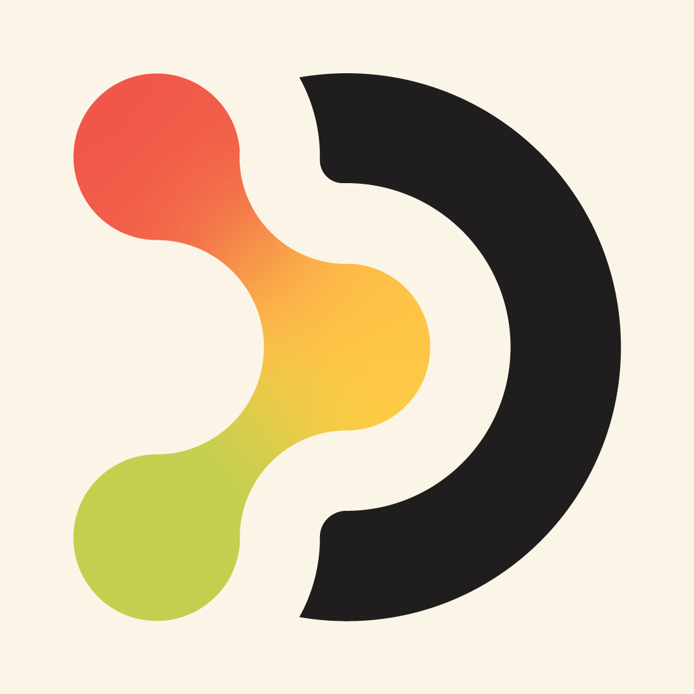

  

Hi, I'm Anish

Android Developer · AI/ML Explorer

Building useful products and exploring intelligent systems.

 

 

About Me

<table>
<tr>
<td width="58%" valign="top">

I'm a Computer Science Engineering student focused on building native Android applications and learning AI/ML.

I like working on complete products — from UI and backend to authentication, APIs, payments, OCR, and deployment.

Currently

Building with Kotlin + Jetpack Compose

Learning Machine Learning

Exploring LLMs and RAG

Experimenting with AI-powered applications

Improving my DSA & problem solving

 

Build. Learn. Ship. Repeat.

</td>

<td width="42%" align="center" valign="middle">

</td>
</tr>
</table>

Featured Projects

<table>
<tr>

<td width="50%" align="center" valign="top">

Owee

UPI-first expense sharing for friends and groups.

 

Kotlin · Jetpack Compose · Supabase

</td>

<td width="50%" align="center" valign="top">

Docuvio

Printing marketplace connecting students with local print shops.

 

Kotlin · Jetpack Compose · Supabase · Razorpay

</td>

</tr>
</table>

Tech Stack

 

  

Android · Kotlin · Jetpack Compose · MVVM

AI / ML · Python · NumPy · Pandas · Scikit-learn

Backend · Supabase · PostgreSQL · REST APIs

Currently Exploring

 

Machine Learning   →   LLMs   →   RAG   →   Agentic AI

GitHub Stats

 

  

Connect

 

  

Thanks for stopping by.

