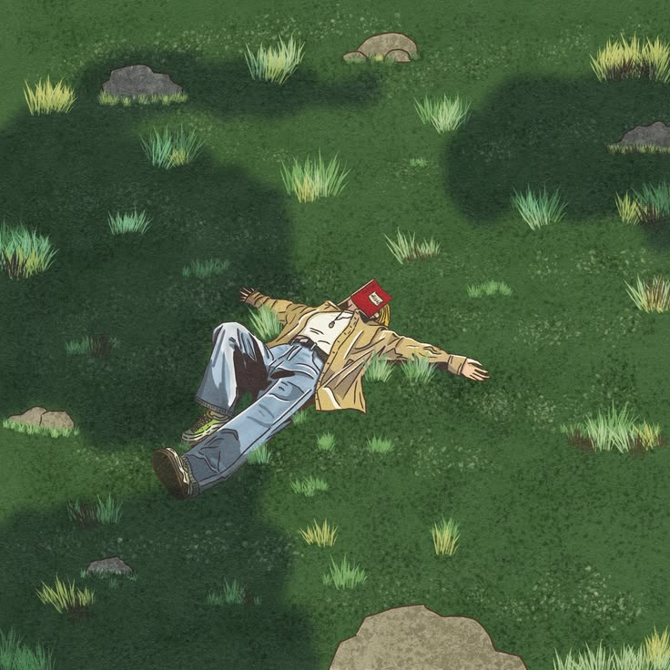

  

  <h1>Hi, I'm Anish Randhawa 👋</h1>
  <h3>Android Developer • AI/ML Explorer</h3>
  

    I build useful software, explore intelligent systems, and turn ideas into products people can actually use.
  

  

    <a href="https://github.com/AnishRandhawa21">GitHub</a>
    ·
    <a href="https://www.linkedin.com/in/anish-randhawa21/">LinkedIn</a>
    ·
    <a href="mailto:randhawa.anish0@gmail.com">Email</a>
  

---

  <h2>About Me</h2>

<table width="100%" align="center">
  <tr>
    <td width="60%" valign="middle" align="left">
      

        I'm a Computer Science Engineering student focused on native Android development and AI/ML.
      

      

        I enjoy building complete products — from interface design and backend integration to authentication, APIs, and polished user experiences.
      

      
<strong>Currently exploring:</strong>

      

        <strong>Android • Kotlin • Jetpack Compose</strong> 
        <strong>Python • Machine Learning • LLMs</strong>
      

    </td>
    <td width="40%" align="center" valign="middle">
      
    </td>
  </tr>
</table>

---

  <h2>Focus Areas</h2>

  
  
  
  
  
  

---

  <h2>Selected Work</h2>

<table width="100%" align="center">
  <tr>
    <td width="50%" align="center" valign="top" style="padding: 12px;">
      
      <h3>OWEE</h3>
      
UPI-first expense sharing for friends and groups.

      
Kotlin • Jetpack Compose • Supabase

    </td>
    <td width="50%" align="center" valign="top" style="padding: 12px;">
      
      <h3>DOCUVIO</h3>
      
A printing marketplace connecting students with local print shops.

      
Kotlin • Jetpack Compose • Supabase • Razorpay

    </td>
  </tr>
</table>

---

  <h2>Tech Stack</h2>

  

  
  
  
  
  
  
  

---

  <h2>Learning & Approach</h2>

<table width="100%" align="center">
  <tr>
    <td width="50%" align="center" valign="top" style="padding: 12px;">
      <h3>Currently Learning</h3>
      
Machine Learning LLMs RAG Agentic AI

    </td>
    <td width="50%" align="center" valign="top" style="padding: 12px;">
      <h3>How I Work</h3>
      
Build first. Understand deeply. Keep improving.

    </td>
  </tr>
</table>

---

  <h2>Let’s Connect</h2>

  
  
  

build • learn • ship

